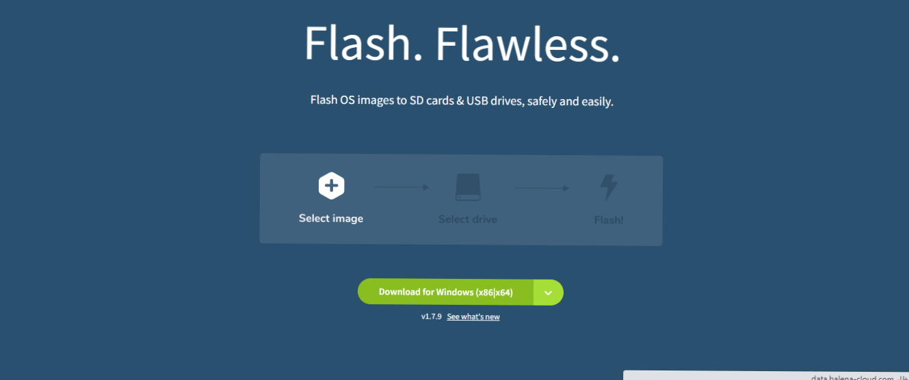

# To Install ROS 2 on Jetson Nano: 

- 1 - Install XUbuntu 20 from the following link: 

   https://forums.developer.nvidia.com/t/xubuntu-20-04-focal-fossa-l4t-r32-3-1-custom-image-for-the-jetson-nano/121768 

- 2 - Flash the image on the SD card from balenaEtcher: 

   https://www.balena.io/etcher/ 

 

- 3 - Extract the zip file you have downloaded and open XUbuntu and write the following commands to extract Xubutun image: 

    tar -xvjf Xubuntu-20.04-l4t-r32.3.1.tar.tbz2 
    
open the program and select the image, then select the device port name. 

*Notes: The flashing takes long time up to 30 minutes. 

#### Once the XUbuntu image is loaded, open the terminal to write the ROS 2 installation commands. 

Get the commands from here: https://docs.ros.org/en/foxy/Installation/Ubuntu-Install-Debians.html 

#### or simply copy/paste from the following: 

### 1 - Set Locale:
- locale 
- sudo apt update && sudo apt install locales
- sudo locale-gen en_US en_US.UTF-8
- sudo update-locale LC_ALL=en_US.UTF-8 LANG=en_US.UTF-8
- export LANG=en_US.UTF-8
- locale

### 2 - Setup Sources:
- apt-cache policy | grep universe 
or 
- sudo apt install software-properties-common
- sudo add-apt-repository universe

- sudo apt update && sudo apt install curl gnupg2 lsb-release
- sudo curl -sSL https://raw.githubusercontent.com/ros/rosdistro/master/ros.key  -o /usr/share/keyrings/ros-archive-keyring.gpg
- echo "deb [arch=$(dpkg --print-architecture) signed-by=/usr/share/keyrings/ros-archive-keyring.gpg] http://packages.ros.org/ros2/ubuntu $(source /etc/os-release && echo $UBUNTU_CODENAME) main" | sudo tee /etc/apt/sources.list.d/ros2.list > /dev/null

### 3 - Installing ROS packages: 
- sudo apt update
- sudo apt upgrade
- sudo apt install ros-foxy-desktop
- sudo apt install ros-foxy-ros-base

### 4 - Environment Setup: 
- source /opt/ros/foxy/setup.bash

Now you are done installing ROS2, try to write command: 
- ROS2 topic list 

and you'll see the default two topics indicating that ros is successfully running. 
